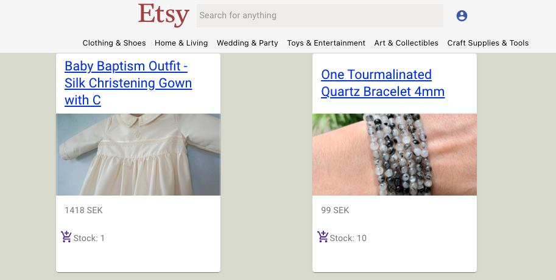
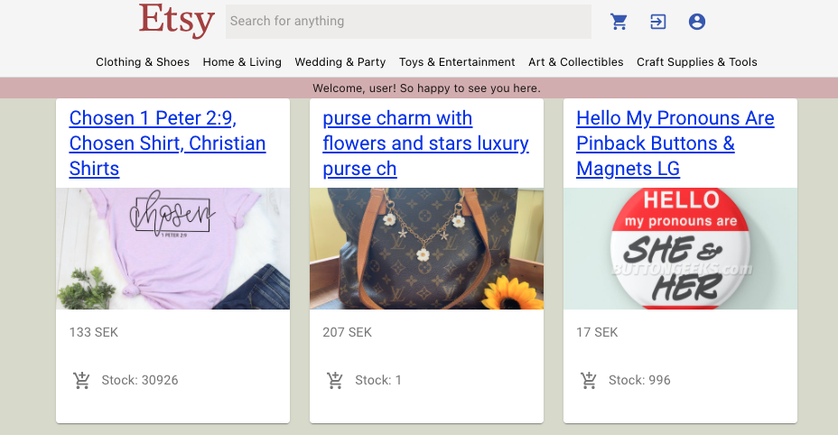

# u10-business-idea-etsy-clone

This project aims at being a European centered Etsy-like webshop where local producers easily can display their products and services as well as giving potential customers a great browsing experience.



By clicking log in the user has access to adding items to their cart:



To see the added items, the user can simply click the cart icon.

We have seen an interest in more local shopping experiences regarding handicraft due to customs duty and the impact that sending an item long distance has on the environment.

## License

This project is licensed under the terms of the MIT license.

## Code standard

| Type           | Casing     | Example         |
| -------------- | ---------- | --------------- |
| Variable name  | camelCase  | authContext     |
| Function name  | camelCase  | getUserProducts |
| Component name | PascalCase | AddProduct      |
| FolderName     | PascalCase | CategoryCard    |
| Indentation    | Tabs       |

# Installation

## Backend

```bash
cd backend
composer install
```

1. To spin up server locally:

```bash
php artisan serve
```

Or to Use Docker to spin up server:

1. Install Sail - make sure to use pgsql when choosing installments (number 1 in choice panel)

```bash
composer require laravel/sail --dev
php artisan sail:install
./vendor/bin/sail composer install
```

2. Change the env variables in .env:
   DB_CONNECTION=pgsql
   DB_HOST=pgsql
   DB_PORT=5432

3. Start sail in Docker

```bash
./vendor/bin/sail up -d
```

## Frontend

Use npm package manager (https://docs.npmjs.com/downloading-and-installing-node-js-and-npm)

Clone the repo and run:

```bash

cd frontend

npm install

npm start

```

To use backend on Heroku:

- change the REACT_APP_URL in /frontend/.env to:
  'https://u10-backend.herokuapp.com/'

## Dependencies

- Node 15

## To choose Node version

```bash
nvm use 15
```

Read more here:

https://tecadmin.net/install-nvm-macos-with-homebrew/

# Contributors

| Name               | GitHub account   |
| ------------------ | ---------------- |
| Thommie Wallin     | @thommie-wallin  |
| Veronica Tapper    | @VeronicaT78     |
| Jakob Jyberg       | @Jakob96         |
| Tatjana Albairmani | @Talica2005      |
| Oskar Findahl      | @OskarFindahl    |
| Johannes Lepsius   | @johanneslepsius |
| William Rössler    | @willrossler     |
| Erik Andersson     | @kireSuomi       |
| Johanna Sjöstrand  | @johannasjo      |

:sparkles: Happy coding! :sparkles:
